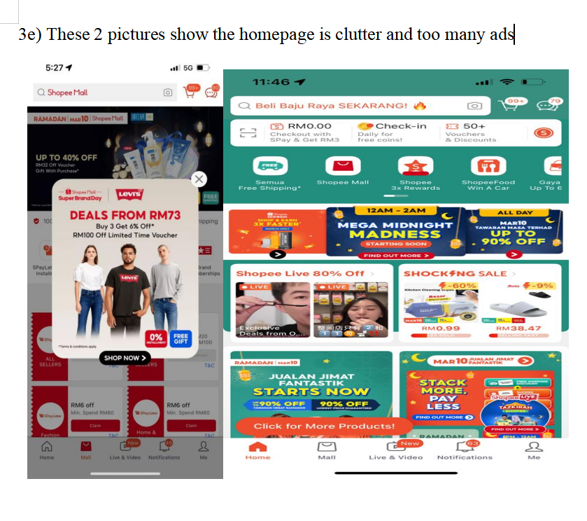

# Shopee UI/UX Heuristic Evaluation  
*Human Computer Interaction Individual Project*

## 📌 Overview
This repository contains a full heuristic evaluation of the Shopee e-commerce
platform, conducted as part of my HCI (Human-Computer Interaction) course.
The project evaluates Shopee’s interface using Jakob Nielsen’s 10 Usability Heuristics
and proposes UI improvements based on real user problems and industry UX standards.

The evaluation covers:
- Interface analysis (layout, navigation, colour scheme, typography)
- Heuristic evaluation across all 10 principles
- Impact analysis for each issue
- Proposed UI improvements with justification
- Supporting evidence from user reviews and industry UX references

## 🧠 Key Skills Demonstrated
- UI/UX analysis  
- Heuristic evaluation (Jakob Nielsen’s 10 principles)  
- User pain point identification  
- Industry research & citation writing  
- Improvements proposal  
- Analytical writing  
- Problem–solution documentation
 ## 🖼 Screenshots from Evaluation

Below are the key user complaints and interface issues identified during the heuristic evaluation of Shopee’s UI/UX design. Each screenshot illustrates a real user pain point, mapped to Nielsen’s usability principles.

---

### 🔹 1. Delivery Delay & Poor Courier Service
**Heuristic Violated:** Visibility of System Status and  User Control and Freedom
Users report extremely slow delivery updates and poor courier communication.  
Shopee does not provide clear, timely system feedback, leading to uncertainty and frustration.

---

### 🔹 2. Voucher Disappointment / Unfair Rewards  
**Heuristic Violated:** Match Between System and Real World  
Promotions shown to users often cannot be redeemed or are misleading.  
This breaks user expectation and reduces trust in the platform.

---

### 🔹 3. TikTok-style Layout Confusion  
**Heuristic Violated:** Consistency and Standards  
Shopee's new layout resembles TikTok's UI, which confuses users and breaks expected e-commerce navigation flow.

---

### 🔹 4. Homepage UI Clutter / Too Many Ads  
**Heuristic Violated:** Aesthetic and Minimalist Design  
Homepage is overloaded with ads and busy elements, reducing usability and overwhelming users visually.

 
